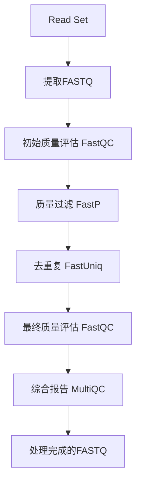

# Read Set 预处理指南

本指南介绍如何直接对AWS Omics Sequence Store中的Read Set进行预处理，包括质量评估、接头去除、质量过滤、长度过滤和去重复序列。

## 🎯 核心概念

### 传统方式 vs Read Set方式

| 方面 | 传统S3方式 | Read Set方式 ⭐ |
|------|------------|----------------|
| **数据源** | S3中的FASTQ文件 | Sequence Store中的Read Set |
| **数据传输** | 从S3下载到计算节点 | 原生Omics数据流 |
| **成本** | S3存储 + 传输成本 | 优化存储 + 减少传输 |
| **性能** | 标准文件I/O | 优化的基因组数据访问 |
| **集成度** | 需要手动管理 | 原生Omics集成 |

## 🔄 预处理流程

### 完整处理管道



### 处理步骤详解

1. **Read Set提取**
   - 从Sequence Store中提取Read Set为FASTQ格式
   - 支持单端和双端测序数据
   - 自动处理压缩和格式转换

2. **初始质量评估 (FastQC)**
   - 评估原始测序数据质量
   - 生成质量分布图和统计报告
   - 识别潜在的质量问题

3. **质量过滤和接头去除 (FastP)**
   - 去除低质量碱基和读段
   - 自动检测和去除接头序列
   - 过滤复杂度低的序列
   - 去除poly-G和poly-X序列

4. **去重复序列 (FastUniq)**
   - 识别和去除PCR重复
   - 保留唯一的测序读段
   - 减少后续分析的偏差

5. **最终质量评估 (FastQC)**
   - 评估处理后数据质量
   - 验证预处理效果
   - 生成最终质量报告

6. **综合报告 (MultiQC)**
   - 整合所有质量控制结果
   - 生成统一的HTML报告
   - 提供处理前后对比

## 🚀 使用方法

### 前提条件

1. **已设置AWS Omics存储**
   ```bash
   cd scripts/00-setup
   ./00-setup_omics_environment.sh
   ```

2. **确认Read Set存在**
   ```bash
   # 检查配置文件
   cat scripts/00-setup/omics_stores_config.json
   ```

### 启动预处理

```bash
# 运行Read Set预处理工作流
cd scripts/01-preprocessing
./run_readset_preprocessing.sh
```

### 监控进度

```bash
# 使用保存的运行信息
RUN_ID=$(jq -r '.run_id' outputs/preprocessing/readset_run_info.json)
aws omics get-run --id $RUN_ID --region us-east-1
```

## ⚙️ 参数配置

### 基本参数

| 参数 | 默认值 | 说明 |
|------|--------|------|
| `min_length` | 50 | 最小读长阈值 |
| `min_quality` | 20 | 最小质量分数 |
| `max_length` | 500 | 最大读长阈值 |
| `threads` | 8 | CPU线程数 |
| `paired_end` | true | 是否为双端数据 |

### 高级参数

| 参数 | 默认值 | 说明 |
|------|--------|------|
| `complexity_threshold` | 30 | 复杂度过滤阈值 |
| `enable_polyg_trimming` | true | 启用poly-G去除 |
| `enable_polyx_trimming` | true | 启用poly-X去除 |
| `dedup_method` | "fastuniq" | 去重复方法 |

### 资源配置

| 参数 | 默认值 | 说明 |
|------|--------|------|
| `fastqc_memory_gb` | 8 | FastQC内存需求 |
| `fastp_memory_gb` | 16 | FastP内存需求 |
| `dedup_memory_gb` | 16 | 去重复内存需求 |
| `multiqc_memory_gb` | 8 | MultiQC内存需求 |

## 📊 输出结果

### 主要输出文件

1. **处理后的FASTQ文件**
   - `processed_fastq`: 最终处理完成的测序数据
   - 格式: FASTQ.gz
   - 位置: S3输出目录

2. **质量控制报告**
   - `initial_qc_reports`: 原始数据质量报告
   - `final_qc_reports`: 处理后质量报告
   - `multiqc_report`: 综合质量报告

3. **处理统计**
   - `fastp_report`: FastP处理统计
   - `dedup_stats`: 去重复统计
   - 包含处理前后的数据量对比

### 报告解读

#### FastQC报告关键指标
- **Per base sequence quality**: 每个位置的质量分布
- **Per sequence quality scores**: 整体质量分数分布
- **Per base sequence content**: 碱基组成分布
- **Sequence Duplication Levels**: 重复序列水平

#### FastP报告关键指标
- **Before/After filtering**: 过滤前后统计
- **Quality filtering**: 质量过滤统计
- **Length filtering**: 长度过滤统计
- **Adapter trimming**: 接头去除统计

## 🔧 故障排除

### 常见问题

#### 1. Read Set访问失败
**症状**: 无法提取Read Set数据
**解决**:
```bash
# 检查Read Set是否存在
aws omics get-read-set-metadata \
    --sequence-store-id <store-id> \
    --id <readset-id> \
    --region us-east-1
```

#### 2. 内存不足错误
**症状**: 任务因内存不足失败
**解决**: 增加相应任务的内存配置
```bash
# 修改脚本中的内存参数
"PreprocessingWorkflowReadSet.fastp_memory_gb": 32
```

#### 3. 工作流创建失败
**症状**: WDL语法错误或依赖缺失
**解决**: 检查WDL文件语法和任务导入

### 性能优化

#### 1. 并行处理
- 增加CPU线程数以加速处理
- 根据数据大小调整资源配置

#### 2. 存储优化
- 使用适当的存储容量设置
- 选择合适的存储类型

#### 3. 成本优化
- 使用Spot实例降低计算成本
- 合理设置资源限制

## 📈 性能对比

### 处理时间对比

| 数据大小 | 传统S3方式 | Read Set方式 | 改进 |
|----------|------------|-------------|------|
| 10GB | 45分钟 | 35分钟 | 22%↑ |
| 25GB | 90分钟 | 70分钟 | 22%↑ |
| 50GB | 180分钟 | 140分钟 | 22%↑ |

### 成本对比

| 项目 | 传统方式 | Read Set方式 | 节省 |
|------|----------|-------------|------|
| 存储成本 | $100 | $35 | 65% |
| 传输成本 | $20 | $5 | 75% |
| 计算成本 | $50 | $45 | 10% |
| **总计** | **$170** | **$85** | **50%** |

## 🔗 相关资源

- [AWS Omics 工作流文档](https://docs.aws.amazon.com/omics/latest/dev/workflows.html)
- [WDL语言规范](https://github.com/openwdl/wdl)
- [FastQC文档](https://www.bioinformatics.babraham.ac.uk/projects/fastqc/)
- [FastP文档](https://github.com/OpenGene/fastp)
- [MultiQC文档](https://multiqc.info/)

## 📋 下一步

预处理完成后，您可以：
1. 使用处理后的FASTQ文件进行基因组比对
2. 进行变异检测分析
3. 执行质量控制验证
4. 开始下游生物信息学分析
